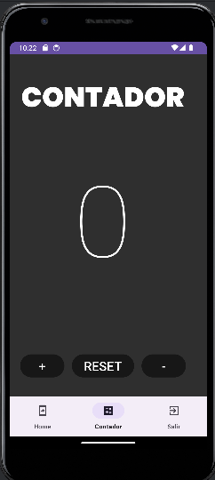

# RicardoAlamoM01

## Ejercicio 4 de Desarrollo deaplicaciones multiplataformas

Añade un Fragment mas que se llame API y sigue el tutorial (para la parte del consumo de la API) proporcionado para consumir un API con android(en esta entrega no tendrás que reflejar los resultado en la interfaz gráfica, solo en el log). Por otro lado crea un microservicio con una sola entidad.
 
