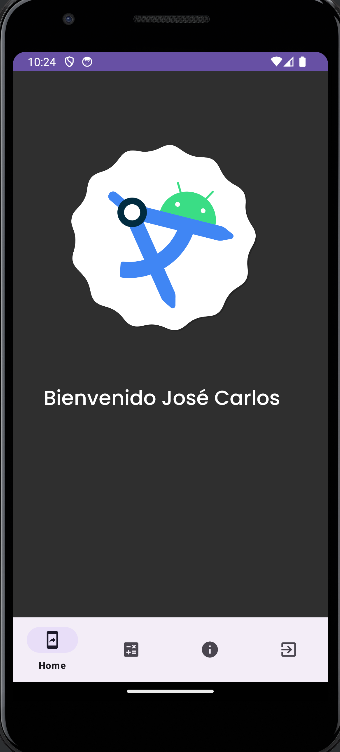
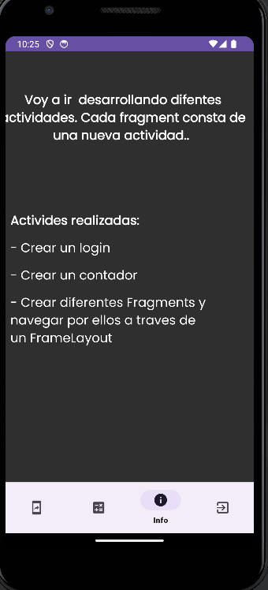
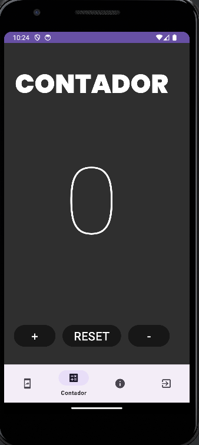

## Ejercicio 3

Modifica el proyecto de manera que el segundo activity ya no sea simplemente un contador, sino que se convierta en un activity con un FrameLayout que mostrará diversos fragments, siendo al menos estos tres: "Home", "Contador" y "Salir". Asimismo, incorpora una barra de navegación que permita transitar entre los diferentes fragments.

Incluyo capturas de pantalla de los tres fragments:

En esta actividad, he implementado un FrameLayout que alberga cuatro fragments, entre los cuales se puede navegar mediante una barra de navegación. El primer fragment es una pantalla básica de inicio ("Home") con una imagen, el segundo corresponde a la actividad previa (contador), el tercero contiene información acerca de todas las actividades realizadas, y el cuarto, denominado "Salir", cierra la sesión y retorna a la pantalla de inicio de sesión al ser pulsado.

Adicionalmente, se han creado nuevos directorios, como "MENU" (donde se ha diseñado un menú con cuatro botones para acceder a todos los fragments), el repositorio "NAVIGATION" que almacena todos los fragments creados, así como nuevos elementos como la imagen de portada y diversos iconos en el directorio "DRAWABLE".