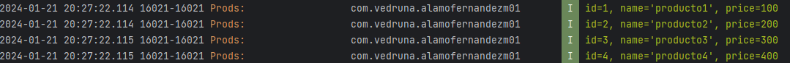

# RicardoAlamoM01

## Ejercicio 3 de Desarrollo deaplicaciones multiplataformas

Cambia el proyecto para que el segundo activity en vez de ser el contador sea un activity con un FrameLayout en el que se verán los diferentes fragments (mínimo home, contador, salir) y por otra parte una barra de navegación con la que podamos viajar entre los diferentes fragments.

 

 
Esta es la pantalla del contador dentro del fragment con el menu abajo.
